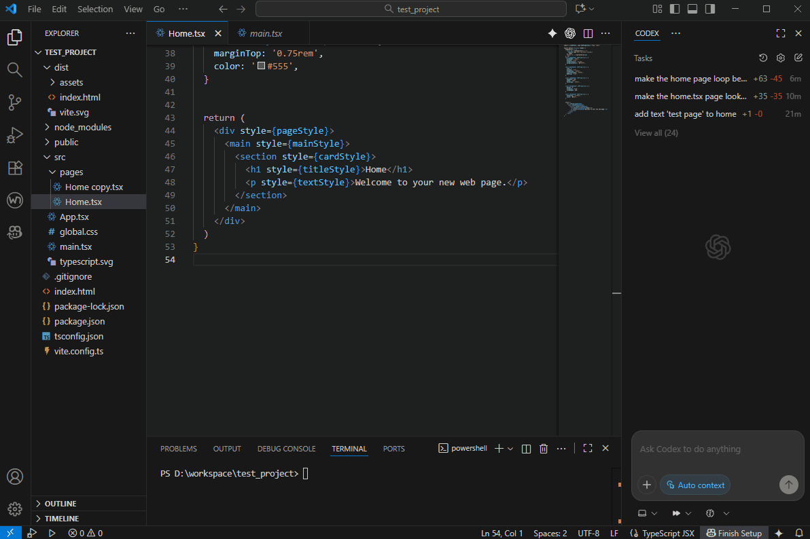

# Browser in VS Code for webview development

English | [한국어](README.ko.md)

## Overview

This extension lets you open and debug URLs (e.g., localhost) inside a VS Code Webview. It is a minimal example extension.

- Command: `Browser in VS Code: Open Webview` — opens a webview with a simple address bar and an iframe.

Note: Many websites block iframe embedding via security policies (CSP / X-Frame-Options). Some URLs may not load inside the webview.

If you want to view console logs from the embedded page, include the script below in your `index.html`:
```html
<script src="https://unpkg.com/iframe-console-relay/dist/index.umd.min.js"></script>
```
For npm usage and details, see:
https://github.com/g2developer/iframe-console-relay

**Caution: Include the above script only during development/debugging. It poses security risks.**

## Demo


This video is a demo of editing a page using Browser in VSCode and an AI agent.
Environment: React, Vite, Codex (AI Agent).
(The segments showing the AI agent working have been removed for time constraints.)

## Development

1. Install dependencies: `npm install`
2. Build: `npm run compile` or `npm run watch`
3. Package VSIX: `npm run build` (or `npm run build:install` to also install)
4. Press F5 to launch the Extension Host, then run the command from the Command Palette.

Development conveniences:
- Editing files under `media/*` automatically reloads the webview.
- Saving under `src` (which updates `out/*`) automatically reloads the VS Code window (restarts the extension host) so changes apply without reinstalling.

### Build/Install scripts
- `npm run build`: compile TypeScript and create a VSIX
- `npm run build:install`: create a VSIX and install to VS Code (`--force` to reinstall), or manually install the built `browser-in-vscode.vsix`


## Troubleshooting

If a PWA service worker in VS Code refuses to clear, close VS Code and force-delete these folders (Windows):
- `C:\Users\<username>\AppData\Roaming\Code\Service Worker`
- `C:\Users\<username>\AppData\Roaming\Code\Cache`
- `C:\Users\<username>\AppData\Roaming\Code\GPUCache`
- `C:\Users\<username>\AppData\Roaming\Code\User\workspaceStorage`


## 💰 Support & Donation

🍪 Buy the Developer a Little Treat
If you find this project helpful, consider buying the developer a snack — even a small treat keeps the energy (and code) flowing!

- [Donate via PayPal](https://paypal.me/gyu8648)
- [Donate via Buy Me a Coffee](https://buymeacoffee.com/gyu2036)
